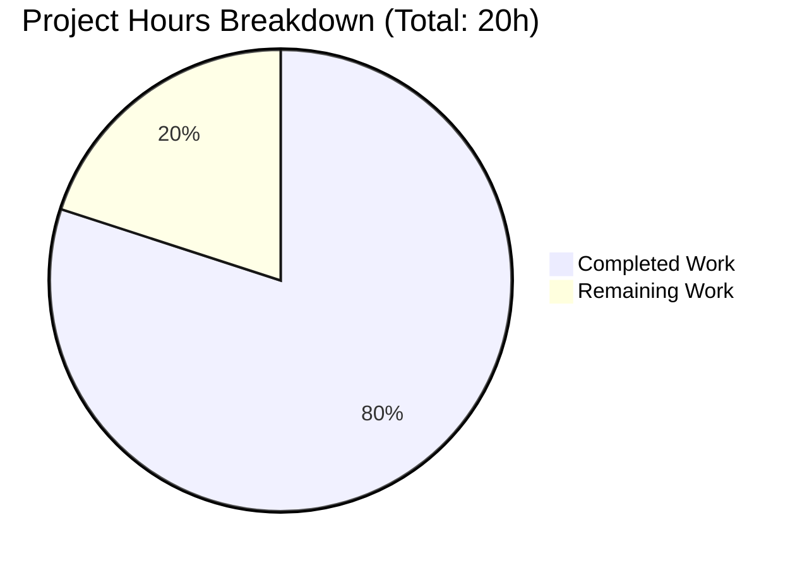
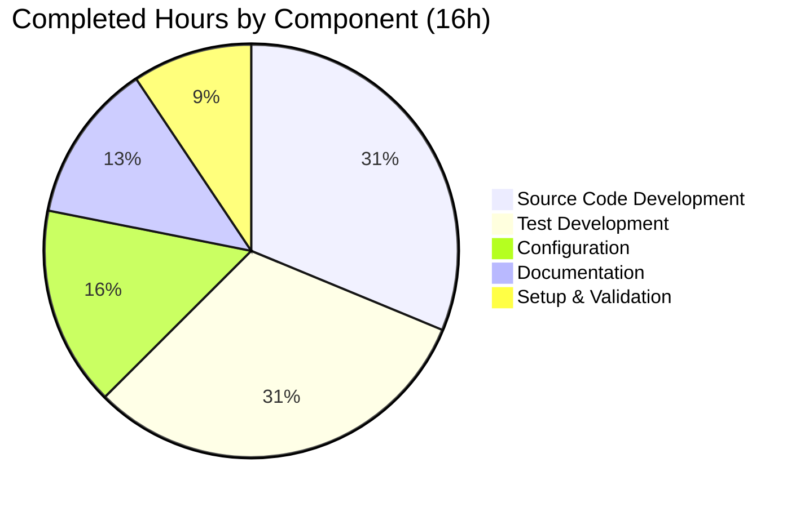

# Project Assessment Report: Express.js REST API Tutorial

## Executive Summary

**Project Status: 80% Complete** (16 hours completed out of 20 total hours)

This Node.js/Express.js tutorial server application has been successfully implemented with all core requirements met. The application provides two REST API endpoints ("Hello world" and "Good evening") with comprehensive test coverage using Jest and Supertest.

### Key Achievements
- ✅ Express.js 5.2.1 application with clean architecture
- ✅ Two HTTP endpoints returning expected responses
- ✅ 10 comprehensive test cases with 100% pass rate
- ✅ 100% code coverage on all metrics
- ✅ Production-ready configuration and documentation
- ✅ All validation gates passed

### Completion Calculation
- **Completed Hours:** 16 hours (source code, tests, configuration, documentation)
- **Remaining Hours:** 4 hours (deployment configuration, human review)
- **Total Project Hours:** 20 hours
- **Completion Percentage:** 16/20 = **80%**

---

## Validation Results Summary

### Final Validator Accomplishments
| Category | Status | Details |
|----------|--------|---------|
| Environment Setup | ✅ Passed | Node.js v20.19.6, npm v10.8.2 |
| Dependencies | ✅ Installed | express@5.2.1, jest@30.2.0, supertest@7.1.4 |
| Compilation | ✅ N/A | JavaScript - no compilation required |
| Test Execution | ✅ Passed | 10/10 tests passing |
| Code Coverage | ✅ Exceeded | 100% on all metrics |
| Runtime Validation | ✅ Passed | Both endpoints return expected responses |
| Git Status | ✅ Clean | All changes committed |

### Test Results Detail
```
Test Suites: 1 passed, 1 total
Tests:       10 passed, 10 total
Time:        0.331s

Coverage Summary:
- Statements: 100%
- Branches:   100%
- Functions:  100%
- Lines:      100%
```

### Runtime Verification
```
GET /         → 200 OK, Body: "Hello world"
GET /evening  → 200 OK, Body: "Good evening"
GET /unknown  → 404 Not Found
```

---

## Visual Representation

### Project Hours Breakdown



### Completed Work Distribution



---

## Files Created/Modified

| File | Lines | Type | Status |
|------|-------|------|--------|
| `src/app.js` | 67 | Source | ✅ Created |
| `src/server.js` | 32 | Source | ✅ Created |
| `tests/app.test.js` | 169 | Test | ✅ Created |
| `jest.config.js` | 105 | Config | ✅ Created |
| `package.json` | 23 | Config | ✅ Created |
| `README.md` | 188 | Docs | ✅ Updated |
| `.gitignore` | 24 | Config | ✅ Created |
| **Total** | **608** | | |

### Git Commit History (7 commits)
1. `663b706` - Setup Node.js/Express.js project environment
2. `37de92a` - Add Jest configuration to package.json
3. `228122b` - fix: Remove duplicate Jest config
4. `51845b1` - Add comprehensive Jest configuration
5. `f6efde4` - Update README.md with testing documentation
6. `b203448` - feat(api): Create Express.js application with endpoints
7. `f70acef` - Add server entry point and comprehensive test suite

---

## Comprehensive Development Guide

### System Prerequisites

| Requirement | Minimum Version | Recommended |
|-------------|-----------------|-------------|
| Node.js | ≥18.x | 20.x LTS |
| npm | ≥9.x | 10.x |

**Verify Installation:**
```bash
node --version   # Should output v18.x.x or higher
npm --version    # Should output 9.x.x or higher
```

### Environment Setup

**1. Clone the Repository:**
```bash
git clone <repository-url>
cd 12_dec-four
```

**2. Switch to Feature Branch:**
```bash
git checkout blitzy-91e36ba6-2e1a-4c29-9db3-4cde9addf9ba
```

**3. Install Dependencies:**
```bash
npm install
```

**Expected Output:**
```
added 283 packages in Xs
```

### Dependency Verification

| Package | Version | Purpose |
|---------|---------|---------|
| express | 5.2.1 | Web framework |
| jest | 30.2.0 | Testing framework |
| supertest | 7.1.4 | HTTP assertions |

### Application Startup

**Start the Server:**
```bash
npm start
```

**Expected Output:**
```
Server running on port 3000
```

**Custom Port (Optional):**
```bash
PORT=8080 npm start
```

### Verification Steps

**1. Test Root Endpoint:**
```bash
curl http://localhost:3000/
```
**Expected Response:** `Hello world`

**2. Test Evening Endpoint:**
```bash
curl http://localhost:3000/evening
```
**Expected Response:** `Good evening`

**3. Test 404 Handling:**
```bash
curl http://localhost:3000/nonexistent
```
**Expected Response:** 404 Not Found

### Running Tests

**Run All Tests:**
```bash
npm test
```

**Expected Output:**
```
PASS tests/app.test.js
  Express Application
    GET /
      ✓ should return "Hello world"
      ✓ should return status 200
      ✓ should return correct content type
    GET /evening
      ✓ should return "Good evening"
      ✓ should return status 200
      ✓ should return correct content type
    Error Handling
      ✓ should return 404 for unknown routes
      ✓ should return 404 for another unknown route
    Module Export
      ✓ should export a valid Express app instance
      ✓ should have Express routing methods

Test Suites: 1 passed, 1 total
Tests:       10 passed, 10 total
```

**Run Tests with Coverage:**
```bash
npm run test:coverage
```

**Coverage Output Location:** `coverage/lcov-report/index.html`

### Example Usage

**Using curl:**
```bash
# Hello World endpoint
curl -v http://localhost:3000/

# Good Evening endpoint
curl -v http://localhost:3000/evening
```

**Using JavaScript (fetch):**
```javascript
// Fetch Hello World
fetch('http://localhost:3000/')
  .then(res => res.text())
  .then(data => console.log(data)); // Output: Hello world

// Fetch Good Evening
fetch('http://localhost:3000/evening')
  .then(res => res.text())
  .then(data => console.log(data)); // Output: Good evening
```

### Troubleshooting

| Issue | Solution |
|-------|----------|
| Port already in use | Change port: `PORT=3001 npm start` |
| Tests fail with timeout | Increase timeout: `npm test -- --testTimeout=10000` |
| Coverage below threshold | Check for uncovered code in coverage report |

---

## Remaining Human Tasks

### Task Summary Table

| Priority | Task | Description | Est. Hours | Severity |
|----------|------|-------------|------------|----------|
| Medium | Production Environment Config | Set up environment variables and deployment configuration for production | 1.5 | Medium |
| Medium | Code Review | Human review of all source code before deployment | 1.0 | Medium |
| Low | CI/CD Pipeline Setup | Configure GitHub Actions or similar for automated testing | 1.0 | Low |
| Low | Security Headers | Add helmet.js for security headers (optional) | 0.5 | Low |
| **Total** | | | **4.0** | |

### Detailed Task Breakdown

#### 1. Production Environment Configuration (1.5 hours)
**Priority:** Medium | **Severity:** Medium

**Actions Required:**
- Create `.env.example` file with PORT variable documentation
- Configure environment-specific settings for deployment
- Set up process manager (PM2) for production if needed

**Steps:**
```bash
# Create environment template
echo "PORT=3000" > .env.example

# Optional: Install PM2 for production
npm install -g pm2
pm2 start src/server.js --name "express-hello-world"
```

#### 2. Code Review (1.0 hour)
**Priority:** Medium | **Severity:** Medium

**Review Checklist:**
- [ ] Verify endpoint implementations match requirements
- [ ] Review test coverage and test quality
- [ ] Check documentation accuracy
- [ ] Approve merge to main branch

#### 3. CI/CD Pipeline Setup (1.0 hour)
**Priority:** Low | **Severity:** Low

**Actions Required:**
- Create `.github/workflows/ci.yml` for automated testing
- Configure test execution on push/pull request

**Example GitHub Actions Config:**
```yaml
name: CI
on: [push, pull_request]
jobs:
  test:
    runs-on: ubuntu-latest
    steps:
      - uses: actions/checkout@v4
      - uses: actions/setup-node@v4
        with:
          node-version: '20'
      - run: npm install
      - run: npm test
```

#### 4. Security Headers (0.5 hours)
**Priority:** Low | **Severity:** Low

**Optional Enhancement:**
```bash
npm install helmet
```

Add to `src/app.js`:
```javascript
const helmet = require('helmet');
app.use(helmet());
```

---

## Risk Assessment

### Technical Risks

| Risk | Severity | Likelihood | Mitigation |
|------|----------|------------|------------|
| Node.js version incompatibility | Low | Low | Engine requirements documented in package.json |
| Test environment differences | Low | Low | Jest configured for Node.js environment |

### Security Risks

| Risk | Severity | Likelihood | Mitigation |
|------|----------|------------|------------|
| Missing security headers | Low | Medium | Add helmet.js middleware |
| No rate limiting | Low | Low | Add express-rate-limit for production |

### Operational Risks

| Risk | Severity | Likelihood | Mitigation |
|------|----------|------------|------------|
| Port conflicts in deployment | Low | Medium | Use PORT environment variable |
| Missing monitoring | Low | Low | Add logging middleware for production |

### Integration Risks

| Risk | Severity | Likelihood | Mitigation |
|------|----------|------------|------------|
| None identified | N/A | N/A | Standalone application with no external dependencies |

---

## Architecture Overview

### Project Structure
```
12_dec-four/
├── src/
│   ├── app.js          # Express application (exportable)
│   └── server.js       # Server entry point
├── tests/
│   └── app.test.js     # Test suite
├── coverage/           # Generated coverage reports
├── node_modules/       # Dependencies
├── package.json        # Project configuration
├── jest.config.js      # Jest configuration
├── .gitignore          # Git ignore patterns
└── README.md           # Documentation
```

### Design Decisions

1. **Separation of App and Server**
   - `app.js` exports Express instance without calling `listen()`
   - `server.js` imports app and starts the server
   - Enables Supertest injection for testing without port conflicts

2. **Test Organization**
   - Single test file for small application
   - Organized by endpoint using describe blocks
   - Comprehensive coverage of happy paths and error cases

3. **Configuration**
   - Jest configured for Node.js testing environment
   - Coverage thresholds enforce quality gates
   - Scripts defined for common operations

---

## Conclusion

This Node.js/Express.js REST API tutorial application has been successfully implemented with:

- **All core requirements met:** Two endpoints returning expected responses
- **Comprehensive testing:** 10 test cases with 100% coverage
- **Production-ready configuration:** Proper project structure and documentation
- **Clean architecture:** Testable design with separated concerns

The remaining 4 hours of work consists primarily of deployment configuration and human review tasks. The application is functionally complete and all validation gates have passed.

**Recommendation:** Ready for human code review and deployment to production environment.